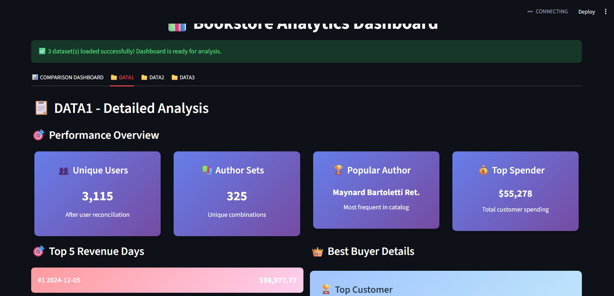

# 📊 Bookstore Analytics Streamlit Website



A comprehensive Streamlit application for processing and analyzing bookstore sales data across multiple datasets.  
Provides business intelligence through interactive visualizations and comparative analytics.

---

## 🚀 Features

- **Multi-Dataset Comparison**: Analyze DATA1, DATA2, and DATA3 side-by-side  
- **Revenue Analytics**: Authors ranked by *revenue*, not frequency  
- **Interactive Visualizations**: Built with Plotly  
- **Customer Insights**: Top customers & spending trends  
- **Full BI Reporting**: Actionable performance metrics

---

## 📁 Project Structure

```
bookstore-analytics/
├── app_streamlit.py          # Main Streamlit dashboard
├── process_data.py       # Data processing logic
├── requirements.txt      # Dependencies
├── web.jpeg        # Dashboard screenshot
└── output/               # Generated dataset outputs
```

---

## 🔧 Installation & Setup

### 1️⃣ Install dependencies
```bash
pip install -r requirements.txt
```

### 2️⃣ Process raw datasets  
⚠ Ensure `orders.parquet`, `books.yaml`, and `users.csv` are in the **project root folder**
```bash
python process_data.py
```

### 3️⃣ Launch Dashboard
```bash
streamlit run app_streamlit.py
```

👉 Open in browser: **http://localhost:8501**

---

## 📊 Dataset Processing

The `process_data.py` script analyzes:

| File | Purpose |
|------|---------|
| `orders.parquet` | Transaction history |
| `books.yaml` | Book metadata (authors, pricing) |
| `users.csv` | Customer info |

It generates:
- 🧾 `*_summary.json` → Key metrics per dataset  
- 📈 `*_daily_revenue.csv` → Daily revenue analytics  

---

## 📈 Dashboard Insights

| Metric | Description |
|--------|-------------|
| 💵 Total Revenue | Total earnings |
| 📆 Best Revenue Days | Top-performing dates |
| 💳 Top Customer | Highest spender |
| 📚 Unique Author Sets | Distinct author combinations |
| 🏆 Top Author | Most revenue generated |
| 🔍 Dataset Comparison | Full BI cross-analysis |

---

## 🛠️ Tech Stack

- Python 3.8+
- Streamlit
- Plotly
- Pandas
- PyYAML

---

## 📦 requirements.txt

```
streamlit
pandas
plotly
pyyaml
```

---

## ✨ Author & Credits

**Your Name**  
🔗 GitHub: [YOUR_GITHUB_PROFILE_URL]  
📧 Email: [YOUR_EMAIL]

---

## 📄 License

This project is for **educational and evaluation purposes only.**

---

## 📌 Final Notes

- Replace placeholders (`https://github.com/Khalodddd/data_engineering_tasks/tree/main/task4`, `khaledsoliman1599@gmail.com`)


